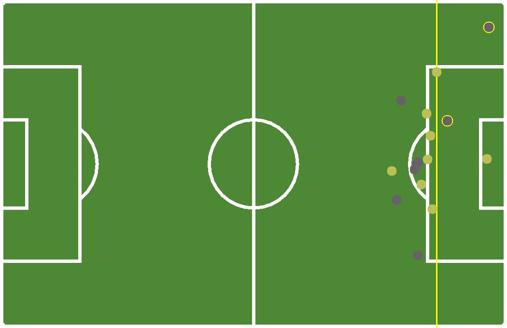
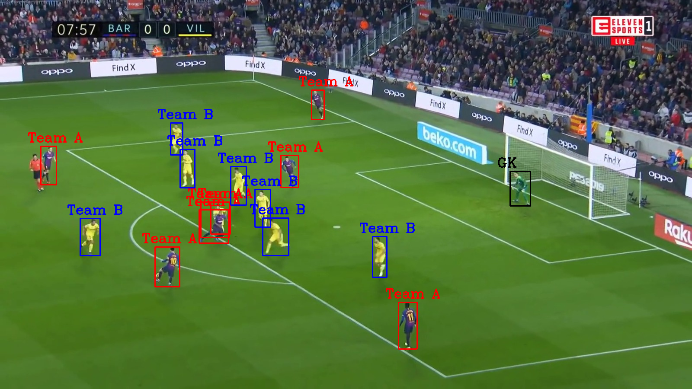
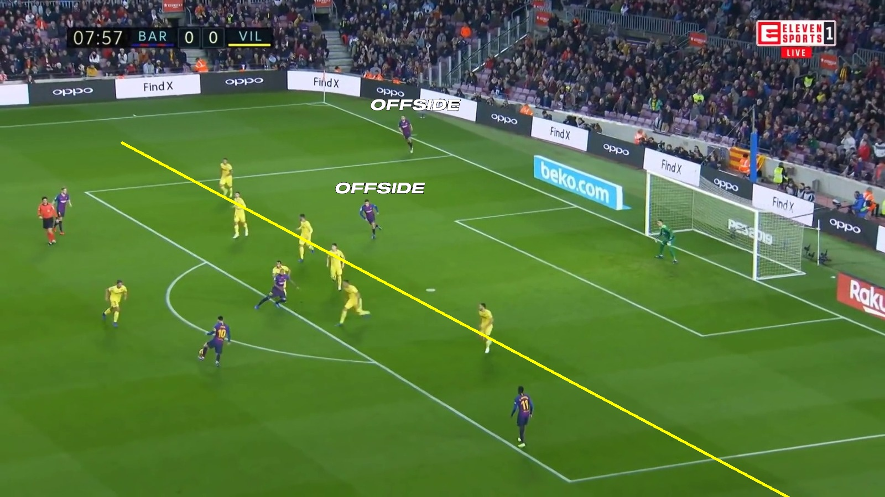

# offside-detection


The project is structured in three parts:
- Homography
- Team Classification
- GUI

```
├── GUI #gui's elements
│   └── src
│       ├── elements
│       ├── fonts
│       ├── icons
│       ├── images
│       └── offside
├── mainGUI.py # main file 
├── model 
│   ├── sportsfield_release #model for camera pose estimation
│   │   ├── calculateHomography.py # file python in which homography is calculated
│   │   ├── datasets
│   │   │   ├── aligned_dataset.py
│   │   ├── models
│   │   │   ├── base_model.py
│   │   │   ├── end_2_end_optimization_helper.py
│   │   │   ├── end_2_end_optimization.py
│   │   │   ├── init_guesser.py
│   │   │   ├── loss_surface.py
│   │   │   └── resnet.py
│   │   ├── out # model homography
│   │   │   ├── pretrained_init_guess
│   │   │   └── pretrained_loss_surface
│   │   ├── utils
│   │   │   ├── constant_var.py
│   │   │   ├── image_utils.py 
│   │   │   ├── metrics.py
│   │   │   ├── util.py
│   │   │   └── warp.py
│   │   └── world_cup_data_augmentation
│   │       ├── h5_builder.py
│   │       ├── raw_data_loader.py
│   │       └── soccer_field_template #templated used for 2D 
│   └── teamClassification #model for player identificaiton
│       ├── frame
│       ├── team_classification.py # file python in which team classification is computed
│       └── weights
├── offside.py # file python where offside is detected
├── result # folder where results are stored
└── samples #some sample frames
```


```

## Install dependencies

> **DISCLAIMER**: A 3.10 or later Python version is required.

The following packages are required to run the application
```sh
# for homography
tqdm
torch
numpy
os
pillow
imageio
# for team classification
ultralytics
sklearn
os
numpy
cv2
math
# for GUI
tkinter
```

## How To Use


## How to run
1. Move to directory where you previously installed the repository
2. Launch 
```sh
python mainGUI.py
```
3. The application makes a prediction on which team is attacking in the picture and marks this team as Team A but the user still can choose which team is attacking beetween Team A and Team B.

## Örnek Çıktılar

### 2D



###classification



### 3D


